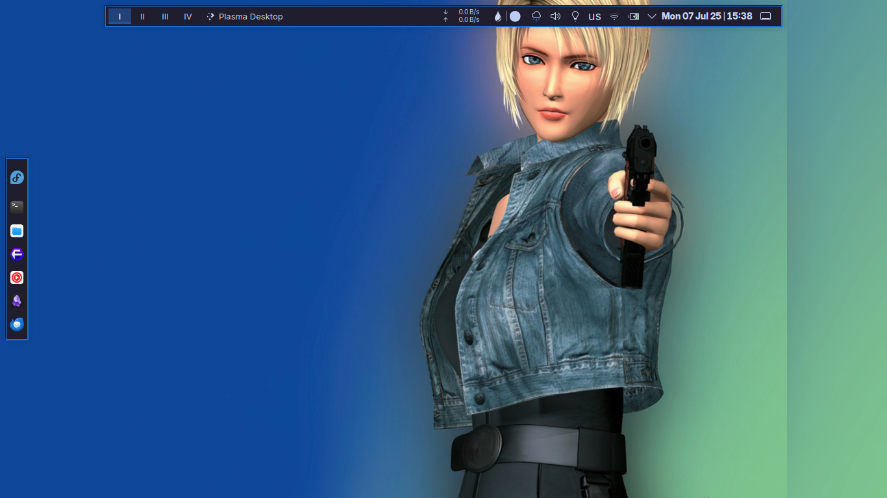

# 🧃 Catppuccin-Rice

This is what happens when you **want that minimalist WM look**...  
but can’t commit to 500 lines of `config` and Lua sorcery 😅  
(**Spoiler:** I still ended up editing config files anyway.)

A hybrid aesthetic rice combining **retro UI layout** with **modern colors and iconography**, powered by **Catppuccin Mocha** and **KDE Plasma**.  
Looks like a window manager, behaves like a DE.  
Perfect for lazy perfectionists™.

---

## 🎨 Features

- 🌑 **Catppuccin Mocha + Lavender** theme applied system-wide.
- 🖥️ **KDE Plasma** with a retro-styled top bar + classic workspace switcher.
- 🚀 Vertical **Icon-only Dock** with:
  - 🖥️ Konsole
  - 🌐 Floorp
  - 🗂️ Dolphin
  - 🧠 Codium
- 🌈 Wallpaper inspired by Parasite Eve — denim core meets desktop vibes.
- 🔢 i3-style workspace layout using KWin: `I`, `II`, `III`, `IV`
- 🍏 macOS-like top panel with network/volume/tray indicators.
- 🎨 App icons themed with [Pure](https://www.pling.com/p/2297060) for that extra drip.
- 🧠 Fonts used like a nerd who cares:
  - **Terminal** → [Departure Mono Nerd Font](https://github.com/ryanoasis/nerd-fonts/releases/download/v3.4.0/DepartureMono.zip)
  - **UI/Desktop** → [Inter](https://rsms.me/inter/) (classy and readable)
  - **Editor (Codium)** → [Roboto Mono Nerd Font](https://github.com/ryanoasis/nerd-fonts/releases/download/v3.4.0/RobotoMono.zip)

---

> _"Catppuccin all the way."_  
> ~ Harsh ☕️

---

> ⚠️ Yeah... it’s a tarball drop.  
> First time sharing a rice publicly, and I’m short on time (currently job hunting).  
> I promise I’ll turn this into modular dotfiles as soon as life stops speedrunning me.
